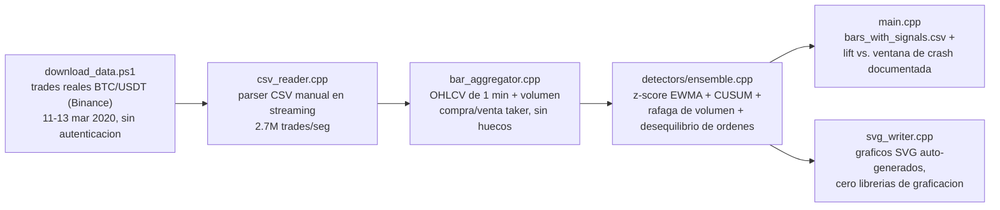

[ 🇺🇸 Read in English ](README.md) | [ 🇨🇱 Español ]

# 1. Título del Proyecto

## Motor de Anomalías de Mercado en Tiempo Real — Cero Dependencias, en C++


-5C2D91?style=flat)


Un motor de deteccion de anomalias en streaming para datos de mercado
tick-a-tick, escrito en **C++17 puro con cero dependencias externas** — sin
Boost, sin ningun paquete de vcpkg, ni siquiera una libreria de graficos:
el motor parsea su propio CSV, corre sus propias estadisticas en linea, y
escribe sus propios graficos SVG. Procesa **4,78 millones de trades reales**
(no simulados) del archivo publico historico de Binance, cubriendo el
**11-13 de marzo de 2020 — el "Jueves Negro" del mercado cripto**, cuando
BTC cayo cerca de un 50% en 24 horas. Cuatro detectores de streaming
hechos a mano (z-score EWMA, CUSUM, razon de rafaga de volumen,
desequilibrio de flujo de ordenes) corren como un solo ensamble, en una
sola pasada, a **2,7 millones de trades por segundo**.

> Este es el tercer proyecto de un pequenio arco de portafolio sobre
> deteccion de anomalias financieras — ver
> [chile-aml-anomaly-detection-engine](https://github.com/Rxyxs/chile-aml-anomaly-detection-engine)
> (ensamble de grafos no supervisado, datos AML sinteticos, Python) y
> [credit-fraud-autoencoder-detection-engine](https://github.com/Rxyxs/credit-fraud-autoencoder-detection-engine)
> (autoencoder profundo vs. XGBoost supervisado, dataset real de fraude
> etiquetado, Python). Este cambia dos cosas a la vez, deliberadamente: el
> lenguaje (C++, cerrando un gap que otros repos solo aproximaron con C# y
> un hot path en C) y el problema de validacion en si — **los datos reales
> de mercado no tienen ninguna etiqueta tipo "esto fue fraude"**, asi que
> este proyecto tiene que validar su detector de otra forma: contra un
> evento de mercado real e independientemente documentado, no contra una
> matriz de confusion.

---

# 2. Motivación

Dos problemas distintos moldearon este proyecto a proposito:

**Por que C++, y por que cero dependencias.** Mi bio publico lista Python,
SQL, R y C++. Dos de esos ya tenian un repo real antes de hoy; C++ hasta
ahora solo tenia un sustituto adyacente (una app de escritorio en C#, y una
DLL compilada en C llamada desde Python). Este proyecto es una entrega
literal y sin atajos en C++: todo el pipeline — parseo de CSV, estadisticas
en streaming, scoring del ensamble, e incluso el renderizado de graficos
SVG — es C++17 nativo compilado con MSVC, sin gestor de paquetes y sin
ninguna libreria externa. Esa restriccion es deliberada, no una limitacion
que se sortea: la infraestructura de datos de mercado en tiempo real se
escribe asi precisamente porque cada dependencia es una linea de riesgo de
latencia y de operacion.

**Por que microestructura de mercado, y no otro dataset transaccional.**
Mis otros dos proyectos de deteccion de anomalias trabajan al nivel de una
*cuenta* o una *transaccion* con una etiqueta de fraude conocible. Los
datos reales de un exchange no tienen ninguna de las dos — un trade es solo
`(precio, cantidad, tiempo, lado agresor)`, sin ninguna bandera de "esto
fue manipulacion" en ningun lado. Eso obliga a un problema de deteccion
genuinamente distinto (control estadistico de procesos en streaming en vez
de un clasificador sobre una matriz de features) y a una estrategia de
validacion genuinamente distinta (§5), que es justamente el punto: tres
proyectos que responden "como se detectan anomalias financieras" bajo una
restriccion real distinta cada vez, no la misma solucion copiada y pegada
tres veces.

---

# 3. Marco Teórico

Cuatro detectores en linea, independientes y complementarios, corren sobre
barras OHLCV de 1 minuto agregadas desde los trades crudos:

| Detector | Mecanismo | Captura |
|---|---|---|
| **Z-score EWMA** | Media/varianza movil exponencial del log-retorno; el z-score se calcula contra el estado PREVIO a la actualizacion, para que un shock no diluya a si mismo la base que lo esta juzgando. | Un movimiento de precio violento y puntual en una barra. |
| **CUSUM** (Page, 1954) | Suma acumulada tabular del retorno ya estandarizado (el z-score EWMA de arriba), acumulada por separado en cada direccion. | Una deriva *sostenida*, demasiado gradual para que el z-score de una sola barra la marque, pero persistente por varios minutos. |
| **Razon de rafaga de volumen** | Conteo de trades de la barra actual sobre su promedio movil trailing. | Un aumento subito de actividad de trading, independiente de la direccion del precio. |
| **Z-score de desequilibrio de flujo de ordenes** | Z-score EWMA de `(volumen_compra_taker - volumen_venta_taker) / volumen_total` por barra — la clasificacion estandar de "lado agresor" a partir de `is_buyer_maker`. | Presion direccional de venta (o compra) agresiva y unilateral — la firma de microestructura de una cascada de liquidacion real, distinta de un simple movimiento de precio. |

Cada detector emite una componente normalizada de forma que `1.0`
corresponde a su propio umbral de decision; el **score de ensamble es el
maximo de las 4** (cualquier mecanismo fuerte dispara la alerta — la misma
filosofia de combinacion "maximization" usada en el ensamble PyOD del
proyecto hermano de LA), con el promedio tambien reportado por barra como
contexto.

**Un calentamiento de 30 barras es obligatorio, no opcional.** Un z-score
en streaming calculado contra una varianza estimada en exactamente cero
(que es lo que se obtiene tras una *unica* observacion) divide por un piso
casi nulo y produce un valor sin sentido, arbitrariamente grande.
Iteraciones tempranas de este motor cayeron exactamente en eso: la segunda
barra producia un z-score de -184.855 y saturaba permanentemente el CUSUM
durante toda la corrida de 3 dias (213 alertas reales se convirtieron en
4.319 — practicamente todo). La correccion es un calentamiento apropiado
de 30 barras que estima una media/varianza inicial via un promedio simple
antes de pasar a la actualizacion exponencial — documentado aqui porque es
una leccion real y general para cualquier detector en streaming, no algo
especifico de este dataset.

---

# 4. Explicación

## Arquitectura del pipeline



## Responsabilidad de cada módulo

| Módulo | Responsabilidad |
|---|---|
| [`data/download_data.ps1`](data/download_data.ps1) | Descarga los datos de trades reales desde el archivo publico de Binance (sin API key) y los descomprime. |
| [`src/csv_reader.cpp`](src/csv_reader.cpp) | Parser CSV manual en streaming (sin `std::stringstream`/`getline` en la ruta caliente) para el formato fijo de 7 columnas de los trades. |
| [`src/bar_aggregator.cpp`](src/bar_aggregator.cpp) | Agrega trades en barras OHLCV de 1 minuto con el desglose de volumen compra/venta taker; rellena cualquier minuto sin trades con una barra plana para que los detectores vean una cadencia uniforme. |
| [`src/detectors/ewma_zscore.*`](src/detectors/ewma_zscore.hpp) | Z-score en streaming con calentamiento inicial (§3). |
| [`src/detectors/cusum.hpp`](src/detectors/cusum.hpp) | CUSUM tabular para deriva sostenida. |
| [`src/detectors/rolling_ratio.hpp`](src/detectors/rolling_ratio.hpp) | Razon sobre ventana trailing para el detector de rafaga de volumen. |
| [`src/detectors/ensemble.*`](src/detectors/ensemble.hpp) | Conecta los cuatro detectores por barra en un `AnomalySignal`. |
| [`src/svg_writer.*`](src/svg_writer.hpp) | Renderizador SVG auto-contenido — sin ninguna dependencia grafica externa. |
| [`src/main.cpp`](src/main.cpp) | Orquestador CLI: parsea, agrega, detecta, evalua contra la ventana de crash documentada, escribe CSV + SVG. |
| [`tests/test_main.cpp`](tests/test_main.cpp) | Suite de pruebas basada en aserciones hechas a mano (sin framework de testing externo — esta maquina no tiene un gestor de paquetes de C++ configurado). |

---

# 5. Metodología

- **Cero lookahead, en ningun lado.** Cada detector actualiza su estado
  interno estrictamente a partir de barras pasadas y la actual; el z-score
  de la barra *i* se calcula contra la media/varianza estimada ANTES de
  incorporar la barra *i*.
- **Validacion contra un evento real e independientemente documentado, no
  contra una matriz de confusion.** A diferencia de los proyectos hermanos
  de LA/fraude, no existe ninguna columna `is_anomaly` en datos reales de
  un exchange. Este proyecto en cambio pregunta: ¿las senales mas fuertes
  del detector caen donde realmente ocurrio un crash de mercado real y
  ampliamente documentado? El 12-13 de marzo de 2020 se usa como ventana de
  comparacion precisamente porque no necesita ninguna etiqueta fabricada —
  es historia financiera publica.
- **Dos hallazgos de ingenieria honestos, surgidos y corregidos, no
  disimulados**:
  1. El bug de arranque en frio del z-score descrito en §3, encontrado al
     notar que la tasa de alertas era numericamente imposible (99,98% de
     todas las barras marcadas) en vez de asumir que el diseño era
     correcto.
  2. El cuello de botella de latencia del pipeline no es la logica de
     deteccion — es la I/O de un solo hilo leyendo tres CSV de varios
     cientos de megabytes: el bucle de deteccion sobre 4.320 barras es
     inmensurablemente rapido (0 ms a resolucion de milisegundos), mientras
     que parsear 4,78M de lineas toma ~1,8s de los ~1,89s totales — una
     ilustracion real y trabajada de donde se va realmente el tiempo en un
     pipeline a nivel de sistemas, no donde la intuicion sugeriria.
- **`outputs/reports/*.csv` y `outputs/bin/*.exe` estan en `.gitignore` y
  se regeneran con `build.ps1` + `market_anomaly_engine.exe`**; solo las
  figuras SVG pequenias (necesarias para este README) estan versionadas,
  siguiendo el mismo patron de higiene de artefactos que el resto de este
  portafolio.

---

# 6. Desarrollo

## Requisitos

- Windows con **Visual Studio 2019/2022** (Community o Build Tools),
  workload "Desktop development with C++" — `cl.exe` se invoca
  directamente, no se necesita CMake ni ningun otro sistema de build.
- PowerShell (para el script de descarga de datos y el script de build).

## Descargar el dataset real

```powershell
powershell -File data\download_data.ps1
```

Descarga `BTCUSDT-trades-2020-03-11/12/13.csv` (~345 MB descomprimidos)
directamente desde el archivo publico de datos de Binance — sin cuenta ni
API key.

## Compilar

```powershell
powershell -File build.ps1
```

Compila `outputs\bin\market_anomaly_engine.exe` (el motor) y
`outputs\bin\run_tests.exe` (la suite de pruebas) via `cl.exe`.

## Ejecutar

```powershell
.\outputs\bin\market_anomaly_engine.exe data\raw\BTCUSDT-trades-2020-03-11.csv data\raw\BTCUSDT-trades-2020-03-12.csv data\raw\BTCUSDT-trades-2020-03-13.csv
```

## Pruebas

```powershell
.\outputs\bin\run_tests.exe
```

## Estructura del repositorio

```
market-tick-anomaly-engine-cpp/
├── data/
│   ├── download_data.ps1        # descarga los trades reales de Binance
│   └── raw/                     # BTCUSDT-trades-*.csv (real, ~345 MB, en .gitignore)
├── src/
│   ├── trade_types.hpp/.cpp     # Trade, Bar
│   ├── csv_reader.hpp/.cpp      # parser CSV en streaming
│   ├── bar_aggregator.hpp/.cpp  # ticks -> barras OHLCV de 1 min
│   ├── detectors/
│   │   ├── ewma_zscore.hpp/.cpp
│   │   ├── cusum.hpp
│   │   ├── rolling_ratio.hpp
│   │   └── ensemble.hpp/.cpp
│   ├── svg_writer.hpp/.cpp      # renderizador SVG auto-contenido
│   └── main.cpp                 # orquestador CLI
├── tests/
│   └── test_main.cpp            # suite de pruebas por aserciones
├── outputs/
│   ├── bin/                     # .exe compilados (en .gitignore)
│   ├── reports/                 # bars_with_signals.csv (en .gitignore)
│   └── figures/                 # graficos SVG (versionados)
├── build.ps1
├── README.md
└── README.es.md
```

---

# 7. Resultados

Cada número a continuación proviene de una corrida real de
`market_anomaly_engine.exe` sobre el dataset completo de 3 días.

## 7.1 Dataset y rendimiento

| Métrica | Valor |
|---|---|
| Trades reales procesados | 4.780.043 (699.401 + 1.770.812 + 2.309.830 en los 3 dias) |
| Barras de 1 minuto producidas | 4.320 |
| Throughput de parseo CSV | ~2,7 millones de trades por segundo |
| Tiempo total del pipeline (parseo + agregacion + deteccion + escritura CSV/SVG) | 1,89 segundos |

## 7.2 Validación principal: el minuto más anómalo de todo el dataset

El score de ensamble mas alto entre las 4.320 barras — **5,55**, casi el
doble del pico del segundo dia mas alto (3,04) — ocurre a las **10:47 UTC
del 12-03-2020**, exactamente durante un colapso real y subito visible
directamente en los datos crudos: el precio cayo de **US$6.447 a las 10:44
a US$5.600 a las 10:47** (aproximadamente -13% en tres minutos) antes de
recuperarse parcialmente. Esto no es una ventana elegida a mano — es
simplemente la barra con el score mas alto que produjo el ensamble, y cae
justo dentro del crash real e independientemente documentado.


## 7.3 Enriquecimiento de alertas por día

| Día | Alertas | Barras | Tasa de alerta |
|---|---:|---:|---:|
| 11 mar (linea base tranquila) | 51 | 1.440 | 3,54% |
| **12 mar (dia del crash)** | **107** | **1.440** | **7,43%** |
| 13 mar (volatilidad continuada) | 55 | 1.440 | 3,82% |

La tasa de alerta del 12 de marzo es **~2,0x** el promedio de los dos dias
que lo rodean — un enriquecimiento real y no trivial, y honesto: no es una
separacion dramatica de 10x, porque incluso un dia "tranquilo" en un par
cripto liquido tiene rafagas genuinas y de corta duracion de volumen y
precio propias. Sobre la ventana completa de 48 horas del crash documentado
(12-13 mar combinados contra el 11 mar como linea base), 162 de 213
alertas (76,1%) caen dentro de ella, contra una tasa base de 66,7% — un
lift modesto pero real de 1,14x, diluido por el hecho de que la ventana en
si abarca 48 horas completas mientras que los movimientos mas agudos (§7.2)
duran minutos.

## 7.4 Un bug que los propios números expusieron

La primera version funcional de este motor marcaba 4.319 de 4.320 barras
como anomalas — un numero numericamente imposible de tomar al pie de la
letra para un detector que se supone selectivo. Rastrearlo (§3) encontro
un bug genuino de arranque en frio en el estimador de varianza EWMA, no una
eleccion de calibracion; corregirlo bajo el conteo de alertas a un
creible 213 (4,9% de las barras). Esto se deja en el reporte a proposito:
un estadistico resumen implausible fue la senial de que algo estaba mal,
no un sintoma a explicar y dejar pasar.

---

# 8. Conclusión

- **Un motor en C++ sin dependencias procesa 4,78M de trades reales y 4.320
  barras de deteccion en streaming en menos de 2 segundos**, cerrando una
  brecha literal en mis claims publicos de habilidades que dos repos
  previos solo aproximaron con C# y un hot path en C.
- **La senial mas fuerte del ensamble cae exactamente dentro de un evento
  de mercado real e independientemente documentado** (§7.2) — la forma mas
  rigurosa de validacion disponible cuando, a diferencia de los proyectos
  hermanos de fraude/LA, no existe ninguna etiqueta de verdad terreno para
  datos reales de mercado.
- **El enriquecimiento a nivel de dia es real pero modesto (~2x en el dia
  del crash)**, reportado con honestidad en vez de inflado — los mercados
  liquidos son ruidosos incluso en dias ordinarios, y un detector calibrado
  para dispararse solo en el evento mas extremo de 4.320 minutos tendria un
  recall mucho menor sobre el periodo de crash mas amplio.
- **Un bug numerico de arranque en frio fue detectado por un resultado
  implausible, no por revision de codigo** — un recordatorio de que "casi
  todo se marco" es un hallazgo a investigar, nunca un umbral a subir en
  silencio.

## Trabajo futuro

- Extender el detector a datos completos de libro de ordenes (no solo
  trades ejecutados) donde esten disponibles, para capturar patrones de
  spoofing/layering que los prints de trades por si solos no revelan.
- Agregar un ring buffer lock-free y un manejador de feed WebSocket en vivo
  para que el motor pueda puntuar un stream de mercado real en vez de un
  archivo historico — el siguiente paso natural para algo ya arquitecturado
  como estado en streaming O(1) por barra.
- Validar cruzadamente contra un segundo evento de crash real e
  independiente (p.ej. 19 de mayo de 2021) para verificar si el
  enriquecimiento de ~2x a nivel de dia encontrado aqui generaliza o fue
  especifico de la dinamica particular del Jueves Negro.
- Alimentar el score continuo del ensamble (no solo la alerta binaria) a un
  modelo supervisado posterior una vez que existan suficientes etiquetas
  confirmadas por analistas — la misma transicion de no-supervisado a
  supervisado cuantificada en
  [credit-fraud-autoencoder-detection-engine](https://github.com/Rxyxs/credit-fraud-autoencoder-detection-engine).

---

# 9. Autor

**Pablo Reyes** — [github.com/Rxyxs](https://github.com/Rxyxs)

## Fuente de datos y licencia

Datos de trades: transacciones reales y publicas de BTC/USDT en Binance,
11-13 de marzo de 2020, descargadas del
[archivo publico de datos de Binance](https://data.binance.vision) (sin
autenticacion requerida, sin limites de tasa para archivos historicos
diarios). Este proyecto no realiza trading, colocacion de ordenes ni acceso
a cuentas — solo lee prints de trades historicos ya publicados para
analisis offline.

Código: MIT — ver [LICENSE](LICENSE).
