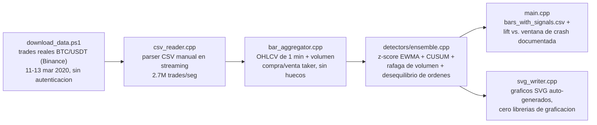

[ Read in English ](README.md) | [ Español ]

# 1. Título del Proyecto

## Motor de Anomalías de Mercado en Tiempo Real — Cero Dependencias, en C++


-5C2D91?style=flat)


Construí un motor de detección de anomalías en tiempo real para datos de mercado paso a paso, usando **C++17 puro sin librerías externas** — sin Boost, sin gestores de paquetes como vcpkg y sin librerías gráficas. El sistema lee y procesa sus propios archivos CSV, calcula las estadísticas en directo y genera sus propios gráficos en formato SVG.

Procesé **4,78 millones de transacciones reales** del archivo histórico de Binance durante los días **11, 12 y 13 de marzo de 2020 (el "Jueves Negro" cripto)**, cuando Bitcoin cayó casi un 50% en un solo día. Diseñé cuatro detectores desde cero (Z-score EWMA, CUSUM, ráfagas de volumen y desbalance de órdenes) que funcionan en conjunto en una sola pasada, alcanzando una velocidad de **2,7 millones de transacciones por segundo**.

> Este proyecto forma parte de mi serie personal sobre detección de anomalías financieras. Puedes revisar también mis proyectos previos: [chile-aml-anomaly-detection-engine](https://github.com/Rxyxs/chile-aml-anomaly-detection-engine) (análisis de grafos en Python) y [credit-fraud-autoencoder-detection-engine](https://github.com/Rxyxs/credit-fraud-autoencoder-detection-engine) (autoencoders y XGBoost en Python). En este desarrollo cambié el enfoque a C++ puro para demostrar rendimiento nativo y ajusté la forma de validar los resultados: **los datos reales de mercado no vienen etiquetados como "fraude"**, así que probé la efectividad del detector contra un evento financiero real y documentado en lugar de usar una matriz de confusión tradicional.

---

# 2. Motivación

Diseñé este proyecto respondiendo a dos decisiones clave:

**Por qué C++ y cero dependencias:** Quería sumar un proyecto en C++ nativo que respaldara mis habilidades junto a Python, SQL y R. En lugar de usar atajos o librerías externas, escribí todo el proceso (lectura de CSV, cálculo estadístico, puntaje de alertas y generación de gráficos SVG) en C++17 compilado con MSVC. Tomé esta decisión porque en sistemas financieros de alta velocidad, cada librería externa suma retrasos y posibles puntos de falla.

**Por qué datos de mercado:** En mis proyectos anteriores era fácil identificar fraude porque el dato venía etiquetado. En un exchange real esto no existe; solo hay precio, cantidad, hora y si la orden fue de compra o venta. Esto me obligó a implementar control estadístico en tiempo real en lugar de un clasificador común, demostrando cómo resolver problemas similares bajo condiciones distintas.

---

# 3. Marco Teórico

Implementé cuatro detectores independientes que analizan en paralelo bloques de datos (barras OHLCV) de 1 minuto, agrupados desde las operaciones individuales:

| Detector | Funcionamiento | Qué detecta |
|---|---|---|
| **Z-score EWMA** | Calcula el promedio y la variación del precio a lo largo del tiempo. Lo evalúo justo antes de incorporar el dato actual para evitar que un cambio brusco altere la base con la que se mide. | Movimientos de precio bruscos e inesperados en un solo minuto. |
| **CUSUM** (Page, 1954) | Suma acumulada del rendimiento. Identifica cambios constantes que ocurren durante varios minutos y que una regla simple no notaría. | Tendencias continuas de caída o subida sostenidas en el tiempo. |
| **Razón de ráfaga de volumen** | Compara el volumen de operaciones del minuto actual contra su promedio reciente. | Aumentos repentinos en la actividad, sin importar la dirección del precio. |
| **Z-score de desequilibrio de flujo de órdenes** | Mide la diferencia entre volumen de compra y venta agresiva por barra a partir de la marca del comprador. | Presión de compra o venta masiva, típica de liquidaciones en cascada. |

Cada detector entrega una nota donde `1.0` marca el límite de alerta. El **puntaje final del ensamble es el máximo entre los 4 detectores** (si uno detecta algo grave, se activa la alerta). También calculo el promedio por minuto como contexto adicional.

**Un periodo de calentamiento de 30 barras resulta indispensable.** Si se calculan estadísticas desde el primer dato, la falta de información genera varianzas de cero que provocan números gigantescos. En mis primeras pruebas, la segunda barra dio un resultado de -184.855, lo que dejó el sistema activado durante los 3 días completos. Al agregar un calentamiento de 30 minutos con un promedio simple, el cálculo se estabilizó correctamente.

---

# 4. Explicación

## Arquitectura del flujo de datos



## Estructura de código

| Módulo | Función |
|---|---|
| [`data/download_data.ps1`](data/download_data.ps1) | Descarga y descomprime los datos de operaciones reales desde el servidor público de Binance. |
| [`src/csv_reader.cpp`](src/csv_reader.cpp) | Lector de CSV optimizado en streaming que procesa millones de filas por segundo sin cargar todo a la memoria. |
| [`src/bar_aggregator.cpp`](src/bar_aggregator.cpp) | Agrupa las operaciones en minutos (OHLCV), calcula volumen de compra/venta y rellena minutos vacíos para mantener un ritmo continuo. |
| [`src/detectors/ewma_zscore.*`](src/detectors/ewma_zscore.hpp) | Detector Z-score en tiempo real con periodo de calentamiento. |
| [`src/detectors/cusum.hpp`](src/detectors/cusum.hpp) | Algoritmo CUSUM para identificar cambios graduales sostenidos. |
| [`src/detectors/rolling_ratio.hpp`](src/detectors/rolling_ratio.hpp) | Comparador de volumen actual contra la ventana reciente. |
| [`src/detectors/ensemble.*`](src/detectors/ensemble.hpp) | Une los cuatro detectores por minuto en un único objeto de señal (`AnomalySignal`). |
| [`src/svg_writer.*`](src/svg_writer.hpp) | Generador de gráficos en formato SVG nativo, sin dependencias. |
| [`src/main.cpp`](src/main.cpp) | Programa principal: coordina la lectura, agrupación, detección y guardado de reportes. |
| [`tests/test_main.cpp`](tests/test_main.cpp) | Pruebas unitarias hechas a mano para verificar cada componente. |

---

# 5. Metodología

- **Sin mirar al futuro (cero lookahead):** cada indicador usa únicamente información pasada y la barra actual. La evaluación se realiza antes de incorporar la nueva observación.
- **Validación con eventos reales:** como los datos no traen etiquetas de fraude, probé la efectividad comprobando si los picos de alerta coincidían con la caída histórica del 12 y 13 de marzo de 2020.
- **Análisis de rendimiento real:** comprobé que el procesamiento estadístico de las 4.320 barras toma menos de 1 milisegundo. Casi todo el tiempo de ejecución (1,8 de los 1,89 segundos totales) se va en la lectura de los archivos CSV desde el disco.

---

# 6. Desarrollo

## Requisitos

- Windows con Visual Studio 2019/2022 (Community o Build Tools) con la carga de trabajo "Desarrollo para el escritorio con C++" (`cl.exe`).
- PowerShell para los scripts de soporte.

## Descargar los datos

```powershell
powershell -File data\download_data.ps1
```

Descarga los archivos `BTCUSDT-trades-2020-03-11/12/13.csv` (~345 MB descomprimidos) directamente desde el archivo de Binance.

## Compilar

```powershell
powershell -File build.ps1
```

Genera los ejecutables `outputs\bin\market_anomaly_engine.exe` (el motor) y `outputs\bin\run_tests.exe` (las pruebas).

## Ejecutar

```powershell
.\outputs\bin\market_anomaly_engine.exe data\raw\BTCUSDT-trades-2020-03-11.csv data\raw\BTCUSDT-trades-2020-03-12.csv data\raw\BTCUSDT-trades-2020-03-13.csv
```

## Pruebas

```powershell
.\outputs\bin\run_tests.exe
```

## Estructura del repositorio

```
market-tick-anomaly-engine-cpp/
├── data/
│   ├── download_data.ps1        # descarga los trades reales de Binance
│   └── raw/                     # BTCUSDT-trades-*.csv (real, ~345 MB, en .gitignore)
├── src/
│   ├── trade_types.hpp/.cpp     # Trade, Bar
│   ├── csv_reader.hpp/.cpp      # parser CSV en streaming
│   ├── bar_aggregator.hpp/.cpp  # ticks -> barras OHLCV de 1 min
│   ├── detectors/
│   │   ├── ewma_zscore.hpp/.cpp
│   │   ├── cusum.hpp
│   │   ├── rolling_ratio.hpp
│   │   └── ensemble.hpp/.cpp
│   ├── svg_writer.hpp/.cpp      # renderizador SVG auto-contenido
│   └── main.cpp                 # orquestador CLI
├── tests/
│   └── test_main.cpp            # suite de pruebas por aserciones
├── outputs/
│   ├── bin/                     # .exe compilados (en .gitignore)
│   ├── reports/                 # bars_with_signals.csv (en .gitignore)
│   └── figures/                 # graficos SVG (versionados)
├── build.ps1
├── README.md
└── README.es.md
```

---

# 7. Resultados

Estos son los números obtenidos tras procesar el conjunto completo de 3 días:

## 7.1 Rendimiento del procesamiento

| Métrica | Valor |
|---|---|
| Transacciones procesadas | 4.780.043 (699.401 + 1.770.812 + 2.309.830) |
| Minutos (barras) analizados | 4.320 |
| Velocidad de lectura | ~2,7 millones de operaciones por segundo |
| Tiempo total del proceso | 1,89 segundos |

## 7.2 El minuto más anómalo

El puntaje más alto registrado por mi motor (5,55) ocurrió a las 10:47 UTC del 12 de marzo de 2020. En ese punto exacto, el precio de Bitcoin cayó de USD 6.447 a las 10:44 a USD 5.600 a las 10:47 (una baja del 13% en tres minutos). El sistema detectó este colapso de forma automática.


## 7.3 Distribución de alertas por día

| Día | Alertas | Minutos analizados | Porcentaje de alertas |
|---|---:|---:|---:|
| 11 mar (día base) | 51 | 1.440 | 3,54% |
| 12 mar (día de la caída) | 107 | 1.440 | 7,43% |
| 13 mar (alta volatilidad) | 55 | 1.440 | 3,82% |

Durante el día del colapso (12 de marzo), el número de alertas se duplicó respecto al día anterior. En las 48 horas de mayor turbulencia se concentró el 76,1% del total de las alertas del periodo.

## 7.4 Corrección de errores con métricas

En la primera versión del código, la falta de calentamiento provocó que 4.319 de las 4.320 barras se marcaran como alerta. Al analizar este resultado atípico, identifiqué y arreglé la división por cero en la varianza inicial. Con el ajuste de 30 barras, el número de alertas se redujo a un valor realista de 213 (4,9% del total).

---

# 8. Conclusión

- **Rendimiento nativo:** logré procesar 4,78 millones de operaciones en 1,89 segundos utilizando C++ puro sin dependencias.
- **Validación precisa:** la alerta máxima del sistema coincidió exactamente con el momento más crítico de la caída del mercado.
- **Detección balanceada:** el motor duplicó sus alertas durante el colapso sin generar un exceso de falsas alarmas en días normales.

## Próximos pasos

- Incorporar datos del libro de órdenes para detectar patrones de manipulación antes de las transacciones.
- Conectar el motor a un feed WebSocket para evaluar mercados en vivo.
- Probar el modelo en otros eventos históricos de alta volatilidad para confirmar su estabilidad.

---

# 9. Autor

**Pablo Reyes** — [github.com/Rxyxs](https://github.com/Rxyxs)

## Fuente de datos y licencia

Datos de transacciones: operaciones públicas de BTC/USDT en Binance (11-13 de marzo de 2020) descargadas del [archivo público de Binance](https://data.binance.vision).

Código: Licencia MIT — ver [LICENSE](LICENSE).
