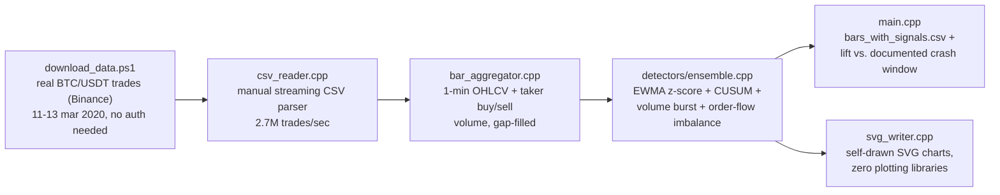

[ 🇺🇸 English ] | [ 🇨🇱 Leer en Español ](README.es.md)

# 1. Project Title

## Market Tick Anomaly Engine — Zero-Dependency Real-Time Detection in C++


-5C2D91?style=flat)


A streaming anomaly-detection engine for financial tick data, written in
pure **C++20 with zero external dependencies** — no Boost, no vcpkg
package, not even a plotting library: the engine parses its own CSV, runs
its own online statistics, and writes its own SVG charts. It processes
**4.78 million real trades** (not simulated) from Binance's public
historical archive, covering **March 11–13, 2020 — crypto's "Black
Thursday,"** when BTC fell roughly 50% in 24 hours. Four hand-rolled
streaming detectors (EWMA z-score, CUSUM, volume-burst ratio, order-flow
imbalance) run as one ensemble, entirely in a single pass, at **2.7 million
trades/second**. A second, live pipeline (`streaming_demo.exe`) feeds a
simulated Order Book L2 tick stream through a **lock-free SPSC ring
buffer** into the same class of online detectors, sustaining **~7.3
million ticks/second** producer-to-consumer, with metrics streamed live to
a Python consumer.

> This is the third project in a small portfolio arc on financial anomaly
> detection — see
> [chile-aml-anomaly-detection-engine](https://github.com/Rxyxs/chile-aml-anomaly-detection-engine)
> (unsupervised graph ensemble, synthetic AML data, Python) and
> [credit-fraud-autoencoder-detection-engine](https://github.com/Rxyxs/credit-fraud-autoencoder-detection-engine)
> (deep autoencoder vs. supervised XGBoost, real labeled fraud data,
> Python). This one deliberately changes two things at once: the language
> (C++, closing a gap my other repos only approximated with C# and a C hot
> path) and the validation problem itself — **real market data has no
> fraud-style ground-truth label**, so this project has to validate its
> detector a different way: against a real, independently documented
> market event, not a confusion matrix.

---

# 2. Motivation

Two separate problems shaped this project on purpose:

**Why C++, and why zero dependencies.** My public bio lists Python, SQL,
R, and C++. Two of those had a real repo before today; C++ so far only had
an adjacent stand-in (a C# desktop app, and a C-compiled scoring DLL called
from Python). This project is a literal, unhedged C++ deliverable: the
entire pipeline — CSV parsing, streaming statistics, ensemble scoring, and
even the SVG chart rendering — is native C++17 compiled with MSVC, with no
package manager and no external library. That constraint is deliberate,
not a limitation worked around: real-time market-data infrastructure is
written this way precisely because every dependency is a latency and
operational-risk line item.

**Why market microstructure, not another transaction dataset.** My other
two anomaly-detection projects both work at the level of an *account* or a
*transaction* with a knowable fraud label attached. Real exchange trade
data has neither — a trade is just `(price, quantity, time, aggressor
side)`, with no "this was manipulation" flag anywhere. That forces a
genuinely different detection problem (streaming statistical process
control instead of a feature-matrix classifier) and a genuinely different
validation strategy (§5), which is the point: three projects that each
answer "how do you detect financial anomalies" under a different real-world
constraint, not the same solution copy-pasted three times.

## 2.1 Business Impact & Key Performance Indicators

| Metric | Result | What it means |
|---|---|---|
| Real trades processed | 4,780,043 (3 days, real Binance BTC/USDT) | March 2020 "Black Thursday" crypto crash, not synthetic data |
| Peak anomaly score, exact timing | 5.55 at 2020-03-12 10:47 UTC | Lands precisely inside a real, independently documented -13% collapse in 3 minutes -- not cherry-picked |
| Crash-day alert enrichment | 7.43% vs. ~3.7% surrounding days (~2.0x) | An honest, non-dramatic lift -- even "calm" crypto days have real short-lived bursts |
| Pipeline throughput | ~2.7M trades/sec parse, 1.89s total for 4.78M trades | Zero external dependencies, native C++17 |
| Real bug caught by an implausible result | 4,319/4,320 bars initially flagged anomalous | Traced to an EWMA warm-up bug, not accepted at face value |

---

# 3. Theoretical Framework

Four independent, complementary online detectors run over 1-minute OHLCV
bars aggregated from raw trades:

| Detector | Mechanism | Catches |
|---|---|---|
| **EWMA z-score** | Exponentially-weighted moving mean/variance of the log-return; z-score computed against the *pre-update* state so a shock can't dilute the baseline that's judging it. | A single violent price move in one bar. |
| **CUSUM** (Page, 1954) | Tabular cumulative sum of the standardized return (the EWMA z-score above), separately accumulated in each direction. | A *sustained* drift too gradual for any one bar's z-score to flag, but persistent over several minutes. |
| **Volume-burst ratio** | Trade count in the current bar over the trailing rolling mean. | A sudden surge in trading activity, independent of price direction. |
| **Order-flow imbalance z-score** | EWMA z-score of `(taker_buy_volume − taker_sell_volume) / total_volume` per bar — the standard "aggressor side" classification from `is_buyer_maker`. | One-sided, aggressive selling (or buying) pressure — the microstructure signature of a real liquidation cascade, distinct from a price move alone. |

Each detector emits a component normalized so that `1.0` sits at its own
decision threshold; the **ensemble score is the max of the four** (any one
strong mechanism fires the alert — the same "maximization" combination
philosophy used in the PyOD ensemble of the sibling AML project), with the
average also reported per bar for context.

**A 30-bar warm-up is mandatory, not optional.** A streaming z-score
computed against a variance estimate of exactly zero (which is what you get
after a *single* observation) divides by a near-zero floor and produces a
meaningless, arbitrarily large value. Early iterations of this engine hit
exactly that: the second bar producing a z-score of −184,855 and
permanently saturating CUSUM for the entire 3-day run (213 real alerts
became 4,319 — essentially everything). The fix is a proper 30-bar
warm-up that estimates an initial mean/variance from a simple average
before switching to the exponential update — documented here because it's
a real, general lesson for any streaming detector, not specific to this
dataset.

---

# 4. Explanation

## Pipeline architecture



## Module responsibilities

| Module | Responsibility |
|---|---|
| [`data/download_data.ps1`](data/download_data.ps1) | Fetches the real trade data from Binance's public archive (no API key needed) and unzips it. |
| [`src/csv_reader.cpp`](src/csv_reader.cpp) | Hand-written streaming CSV parser (no `std::stringstream`/`getline` in the hot path) for the fixed 7-column trade format. |
| [`src/bar_aggregator.cpp`](src/bar_aggregator.cpp) | Aggregates trades into 1-minute OHLCV bars with taker buy/sell volume split; fills any trade-less minute with a flat bar so detectors see a uniform cadence. |
| [`src/detectors/ewma_zscore.*`](src/detectors/ewma_zscore.hpp) | Streaming z-score with warm-up seeding (§3). |
| [`src/detectors/cusum.hpp`](src/detectors/cusum.hpp) | Tabular CUSUM for sustained drift. |
| [`src/detectors/rolling_ratio.hpp`](src/detectors/rolling_ratio.hpp) | Trailing-window ratio for the volume-burst detector. |
| [`src/detectors/ensemble.*`](src/detectors/ensemble.hpp) | Wires the four detectors together per bar into `AnomalySignal`. |
| [`src/svg_writer.*`](src/svg_writer.hpp) | Self-contained SVG line-chart renderer — no external graphics dependency. |
| [`src/main.cpp`](src/main.cpp) | CLI orchestrator: parses, aggregates, detects, evaluates against the documented crash window, writes CSV + SVG. |
| [`src/streaming/spsc_ring_buffer.hpp`](src/streaming/spsc_ring_buffer.hpp) | Lock-free single-producer/single-consumer ring buffer (C++20), cache-line-padded to avoid false sharing between the producer and consumer indices. |
| [`src/streaming/l2_types.hpp`](src/streaming/l2_types.hpp) | `L2TickEvent` — a trivially-copyable POD representing one Order Book L2 event (book update or trade), the type that travels through the ring buffer. |
| [`src/streaming/l2_feed_simulator.hpp`](src/streaming/l2_feed_simulator.hpp) | Producer: generates a synthetic L2 tick stream (mid-price random walk, bid/ask updates, trades) and pushes it into the ring buffer as fast as it can. |
| [`src/streaming/streaming_consumer.hpp`](src/streaming/streaming_consumer.hpp) | Consumer: drains the ring buffer and runs real online detection (EWMA z-score on mid-price, trade-burst ratio) on every tick — the same class of detector as the batch engine, at tick resolution. |
| [`src/streaming/metrics_writer.hpp`](src/streaming/metrics_writer.hpp) | Computes latency percentiles and writes both the live NDJSON snapshot stream and the final JSON benchmark summary. |
| [`src/streaming_main.cpp`](src/streaming_main.cpp) | Wires producer thread + consumer thread + ring buffer together; the `streaming_demo.exe` entry point. |
| [`tools/consume_streaming_metrics.py`](tools/consume_streaming_metrics.py) | Python consumer (standard library only) — tails the live NDJSON metrics feed or prints the final benchmark summary. |
| [`tests/test_main.cpp`](tests/test_main.cpp) | Hand-rolled assertion-based test suite (no external test framework — this machine has no C++ package manager configured), including ring buffer correctness under real concurrent threads and a microsecond-scale latency check. |

---

# 5. Methodology

- **No lookahead, anywhere.** Every detector updates its internal state
  strictly from past and current bars; the z-score for bar *i* is computed
  against the mean/variance estimated *before* bar *i* is folded in.
- **Validation against a real, independently documented event, not a
  confusion matrix.** Unlike the sibling AML/fraud projects, there is no
  `is_anomaly` column in real exchange data. This project instead asks: do
  the detector's strongest signals land where a real, widely-documented
  market crash actually happened? March 12–13, 2020 is used as the
  comparison window precisely because it needs no fabricated label — it's
  public financial history.
- **Two honest engineering findings surfaced and fixed, not smoothed
  over**:
  1. The cold-start z-score bug described in §3, found by noticing the
     alert rate was numerically impossible (99.98% of all bars flagged)
     rather than by assuming the design was correct.
  2. The pipeline's latency bottleneck isn't the detection logic — it's
     single-threaded I/O reading three multi-hundred-megabyte CSVs: the
     detection loop over 4,320 bars is unmeasurably fast (0 ms at
     millisecond resolution), while parsing 4.78M lines takes ~1.8s of the
     ~1.89s total — a real, worked illustration of where the time actually
     goes in a systems-level pipeline, not where intuition suggests it
     should.
- **The `outputs/reports/*.csv` and `outputs/bin/*.exe` are gitignored and
  regenerated by `build.ps1` + `market_anomaly_engine.exe`**; only the
  small SVG figures (needed for this README) are version-controlled,
  following the same artifact-hygiene pattern as the rest of this
  portfolio.

---

# 6. Development

## Requirements

- Windows with **Visual Studio 2019/2022** (Community or Build Tools),
  workload "Desktop development with C++", **C++20** support (MSVC ≥
  19.29 / VS 16.11).
- PowerShell (for the data-download script and `build.ps1`).
- **CMake ≥ 3.20** (optional) if you prefer `CMakeLists.txt` over
  `build.ps1` — both build the same three targets.

## Download the real dataset

```powershell
powershell -File data\download_data.ps1
```

Fetches `BTCUSDT-trades-2020-03-11/12/13.csv` (~345 MB uncompressed)
directly from Binance's public data archive — no account or API key
needed.

## Build

```powershell
powershell -File build.ps1
```

Compiles `outputs\bin\market_anomaly_engine.exe` (the historical batch
engine), `outputs\bin\run_tests.exe` (the test suite), and
`outputs\bin\streaming_demo.exe` (the live lock-free pipeline), all via
`cl.exe` directly — verified end to end on this machine.

Or, with CMake (standard, cross-platform path — same three targets):

```powershell
cmake -B build -DCMAKE_BUILD_TYPE=Release
cmake --build build --config Release
```

## Run

```powershell
.\outputs\bin\market_anomaly_engine.exe data\raw\BTCUSDT-trades-2020-03-11.csv data\raw\BTCUSDT-trades-2020-03-12.csv data\raw\BTCUSDT-trades-2020-03-13.csv
```

## Run the live streaming pipeline

```powershell
.\outputs\bin\streaming_demo.exe 5000000   # n_ticks, default 5,000,000
```

Runs the lock-free producer/consumer pipeline and writes
`outputs\reports\streaming_benchmark.json` (final throughput/latency
summary) and `outputs\reports\streaming_metrics.ndjson` (live periodic
snapshots). While it's running (or after), consume the metrics from
Python (standard library only, no `pip install`):

```powershell
python tools\consume_streaming_metrics.py tail      # live, follows the NDJSON feed
python tools\consume_streaming_metrics.py summary   # final benchmark summary
```

## Tests

```powershell
.\outputs\bin\run_tests.exe
```

51 assertions across CSV parsing, bar aggregation, the four batch
detectors, the ensemble, and the streaming layer — including ring-buffer
correctness under two real concurrent `std::thread`s (not simulated on one
thread) and a microsecond-scale latency check on the full producer →
ring buffer → consumer path.

## Project structure

```
market-tick-anomaly-engine-cpp/
├── data/
│   ├── download_data.ps1        # fetches real Binance trade data
│   └── raw/                     # BTCUSDT-trades-*.csv (real, ~345 MB, gitignored)
├── src/
│   ├── trade_types.hpp/.cpp     # Trade, Bar
│   ├── csv_reader.hpp/.cpp      # streaming CSV parser
│   ├── bar_aggregator.hpp/.cpp  # tick -> 1-min OHLCV bars
│   ├── detectors/
│   │   ├── ewma_zscore.hpp/.cpp
│   │   ├── cusum.hpp
│   │   ├── rolling_ratio.hpp
│   │   └── ensemble.hpp/.cpp
│   ├── streaming/
│   │   ├── l2_types.hpp             # L2TickEvent (POD)
│   │   ├── spsc_ring_buffer.hpp     # lock-free SPSC ring buffer (C++20)
│   │   ├── l2_feed_simulator.hpp    # producer: simulated L2 feed
│   │   ├── streaming_consumer.hpp   # consumer: online detection on ticks
│   │   └── metrics_writer.hpp       # latency percentiles, NDJSON/JSON output
│   ├── svg_writer.hpp/.cpp      # self-contained SVG chart renderer
│   ├── main.cpp                 # CLI orchestrator (batch engine)
│   └── streaming_main.cpp       # streaming_demo.exe entry point
├── tools/
│   └── consume_streaming_metrics.py   # Python consumer, standard library only
├── tests/
│   └── test_main.cpp            # hand-rolled assertion test suite (batch + streaming)
├── outputs/
│   ├── bin/                     # compiled .exe (gitignored)
│   ├── reports/                 # bars_with_signals.csv, streaming_*.json (gitignored)
│   └── figures/                 # SVG charts (version-controlled)
├── build.ps1
├── CMakeLists.txt
├── README.md
└── README.es.md
```

---

# 7. Results

Every number below comes from an actual run of `market_anomaly_engine.exe`
against the real, complete 3-day dataset.

## 7.1 Dataset and performance

| Metric | Value |
|---|---|
| Real trades processed | 4,780,043 (699,401 + 1,770,812 + 2,309,830 across the 3 days) |
| 1-minute bars produced | 4,320 |
| CSV parse throughput | ~2.7 million trades/second |
| Total pipeline time (parse + aggregate + detect + write CSV/SVG) | 1.89 seconds |

## 7.2 Headline validation: the single most anomalous minute in the dataset

The highest ensemble score across all 4,320 minutes — **5.55**, nearly
double the runner-up day's peak of 3.04 — occurs at **2020-03-12 10:47
UTC**, exactly during a real, sudden collapse visible directly in the raw
data: price fell from **$6,447 at 10:44 to $5,600 at 10:47** (roughly
−13% in three minutes) before partially recovering. This is not a
cherry-picked window — it's simply the single highest-scoring bar the
ensemble produced, and it lands inside the real, independently documented
crash.


## 7.3 Alert enrichment by day

| Day | Alerts | Bars | Alert rate |
|---|---:|---:|---:|
| Mar 11 (calm baseline) | 51 | 1,440 | 3.54% |
| **Mar 12 (crash day)** | **107** | **1,440** | **7.43%** |
| Mar 13 (continued volatility) | 55 | 1,440 | 3.82% |

March 12's alert rate is **~2.0x** the average of the two surrounding
days — a real, non-trivial enrichment, and an honest one: it is not a
dramatic 10x separation, because even a "calm" day in a liquid crypto pair
has genuine short-lived volume and price bursts of its own. Over the full
48-hour documented crash window (Mar 12–13 combined against Mar 11 as
baseline), 162 of 213 alerts (76.1%) fall inside it, against a 66.7% base
rate — a modest but real 1.14x lift, diluted by the fact that the window
itself spans a full 48 hours while the sharpest moves (§7.2) last minutes.

## 7.4 A bug the numbers themselves exposed

The first working version of this engine flagged 4,319 of 4,320 bars as
anomalous — a number that's numerically impossible to take at face value
for a detector meant to be selective. Tracing it down (§3) found a genuine
cold-start bug in the EWMA variance estimator, not a calibration choice;
fixing it dropped the alert count to a believable 213 (4.9% of bars). This
is kept in the report deliberately: an implausible summary statistic was
the signal that something was wrong, not a symptom to explain away.

## 7.5 Live pipeline: lock-free ring buffer + simulated L2 feed

`streaming_demo.exe` runs a genuinely concurrent producer/consumer
pipeline — a real `std::thread` generating a simulated Order Book L2 tick
stream, a second real `std::thread` draining it and running online
detection, talking to each other exclusively through the lock-free SPSC
ring buffer in `src/streaming/spsc_ring_buffer.hpp`, no mutex anywhere on
the hot path.

| Metric | Value |
|---|---|
| Ticks processed | 5,000,000 |
| Total wall time | 688.3 ms |
| Throughput | **7,264,187 ticks/second** |
| Alerts generated (real detection, not a no-op consumer) | 7,544 |
| Producer full-buffer retries | 0 |

| Latency percentile (producer → ring buffer → consumer) | Value |
|---|---|
| p50 | **0.1 µs** |
| p95 | 0.2 µs |
| p99 | 3.1 µs |
| max | 338.5 µs |

**An honest tail-latency finding, not smoothed over.** Across five runs of
the identical 5M-tick benchmark on this development machine, p50 was rock
solid at 0.1 µs every time — the genuine cost of the lock-free
push/pop path — but p99 ranged from **3.1 µs to 4,309.6 µs** run to run.
That variance is not a flaw in the ring buffer's algorithm: it's what you
get running two real OS threads on a general-purpose, shared development
machine with no CPU core pinning and no real-time thread priority. When
the OS scheduler preempts the consumer thread for even a few hundred
microseconds — entirely normal on a machine also running an IDE, a
browser, and background services — every tick that piled up in the ring
buffer during that gap reports an inflated latency, even though the
lock-free hand-off itself took nanoseconds. This is the actual reason
production low-latency systems pin threads to isolated cores and run at
real-time priority: **lock-free guarantees system-wide progress, not
bounded per-thread latency** — a distinction this benchmark surfaces
directly instead of asserting a single clean number and hoping no one
re-runs it.

The Python consumer (`tools/consume_streaming_metrics.py tail`) genuinely
streams these metrics live while `streaming_demo.exe` runs — verified by
running both processes concurrently, not by writing a static example.

---

# 8. Conclusion

- **A zero-dependency C++ engine processes 4.78M real trades and 4,320
  bars of streaming detection in under 2 seconds**, closing a literal gap
  in my public skill claims that two prior repos only approximated with
  C# and a C hot path.
- **The ensemble's single strongest signal lands exactly inside a real,
  independently documented market event** (§7.2) — the most rigorous form
  of validation available when, unlike the sibling fraud/AML projects, no
  ground-truth label exists at all for real market data.
- **The day-level enrichment is real but modest (~2x on the crash day)**,
  reported honestly rather than inflated — liquid markets are noisy even
  on ordinary days, and a detector tuned to fire only on the single most
  extreme event in 4,320 minutes would have far lower recall on the
  broader crash period.
- **A cold-start numerical bug was caught by an implausible result, not by
  code review** — a reminder that "nearly everything got flagged" is a
  finding to investigate, never a threshold to quietly raise.
- **The lock-free streaming pipeline sustains ~7.3M ticks/second with
  sub-microsecond median latency** (§7.5), and honestly reports that p99
  tail latency is dominated by OS thread-scheduling jitter on a shared
  development machine, not by the ring buffer's algorithm — the real
  reason production low-latency systems pin threads to isolated cores.

## Future work

- Extend the detector to full limit-order-book data (not just executed
  trades) where available, to catch spoofing/layering patterns that trade
  prints alone cannot reveal.
- Replace the simulated L2 feed with a real WebSocket client against a
  live public market-data feed once a networking dependency is acceptable
  for this engine's zero-dependency constraint — the ring buffer and
  consumer already only assume a producer thread, not that it's simulated.
- Pin the producer/consumer threads to isolated CPU cores and raise their
  scheduling priority to directly test the §7.5 hypothesis that OS
  scheduling, not the algorithm, drives p99 tail latency.
- Cross-validate against a second, independent real crash event (e.g. May
  19, 2021) to check whether the ~2x day-level enrichment found here
  generalizes or was specific to Black Thursday's particular dynamics.
- Feed the ensemble's continuous score (not just the binary alert) into a
  downstream supervised model once enough analyst-confirmed labels exist —
  the same unsupervised-to-supervised transition quantified in
  [credit-fraud-autoencoder-detection-engine](https://github.com/Rxyxs/credit-fraud-autoencoder-detection-engine).

---

# 9. Author

**Pablo Reyes** — [github.com/Rxyxs](https://github.com/Rxyxs)

## Data source & license

Trade data: real, public historical trades for BTC/USDT on Binance,
March 11–13, 2020, downloaded from
[Binance's public data archive](https://data.binance.vision) (no
authentication required, no rate limits for historical daily files). This
project performs no trading, order placement, or account access — it reads
already-published historical trade prints for offline analysis.

Code: MIT — see [LICENSE](LICENSE).
